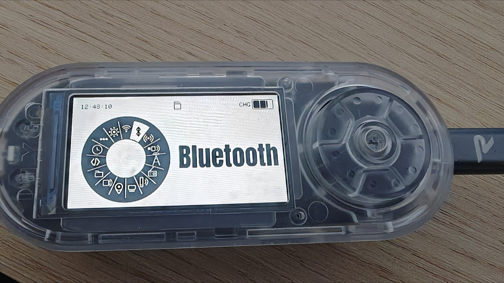
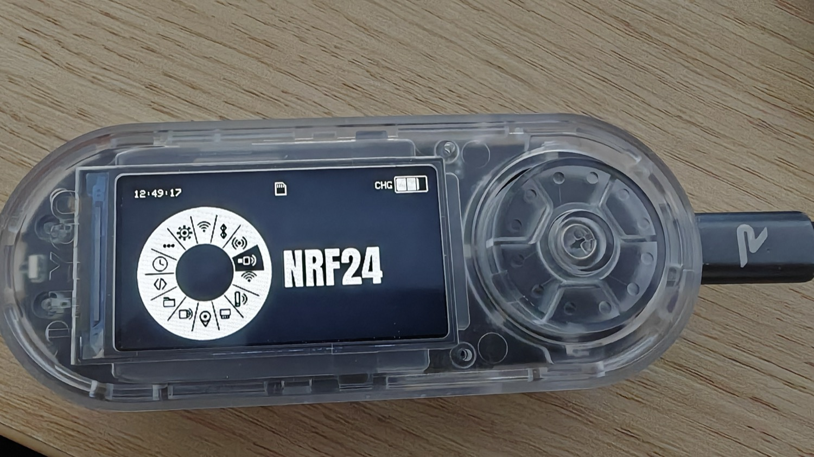
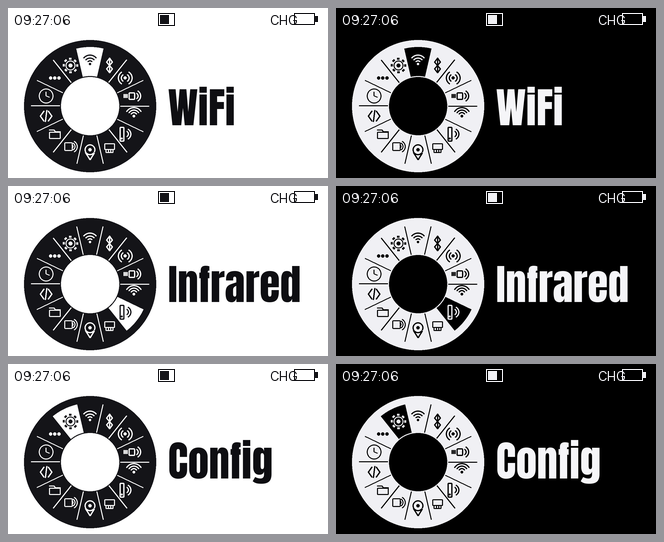

# 🎡 Bruce Wheel Theme

[](https://github.com/BruceDevices/firmware) [](https://github.com/BruceDevices/firmware) [](LICENSE)

> **EN** — A bold **radial-wheel** UI theme for the **[Bruce firmware](https://github.com/BruceDevices/firmware)** on the LilyGO T-Embed CC1101 (320×170). Every menu entry shows a **wheel of all the menu icons on the left** — with the current one highlighted by inversion — and the **entry name in big Anton type on the right**, on a clean monochrome background. Two colorways: **Light** (black wheel / white bg / black text) and **Dark** (white wheel / black bg / white text).

Thème UI **« roue radiale »** pour le firmware **[Bruce](https://github.com/BruceDevices/firmware)** (testé sur **LilyGO T-Embed CC1101**, écran 320×170). Chaque entrée du menu affiche une **roue reprenant tous les pictos du menu à gauche** — celui en cours est mis en **surbrillance par inversion** — et le **nom de l'entrée en gros** (police **Anton**) à droite, sur fond monochrome épuré.



## 🎨 Deux variantes

| Variante | Roue | Fond | Texte |
|----------|------|------|-------|
| **Wheel_Light** | noire | blanc | noir |
| **Wheel_Dark**  | blanche | noir | blanc |

| Light (T-Embed) | Dark (T-Embed) |
|-----------------|----------------|
|  |  |

Aperçu des écrans (rendu) :



## ✨ Caractéristiques

- **Roue à gauche** avec les **15 pictos** du menu (WiFi, Bluetooth, RF, NRF24, LoRa, FM, Infrared, Ethernet, GPS, RFID, Files, Scripts, Clock, Others, Config).
- **Picto actif en surbrillance** (inversion) → effet « roue qui tourne » quand on navigue.
- **Titre en gros à droite**, police **Anton** (dynamique, très lisible en petit).
- **Monochrome** propre, cohérent jusque dans les sous-menus (`priColor`/`bgColor`).
- Images **140 px** (hauteur recommandée T-Embed) → **pas de coupe**, calées sous la barre d'état.

## 🚀 Installation

1. Copie le dossier de la variante voulue (**`Wheel_Light`** ou **`Wheel_Dark`**) sur la **carte SD** (ou en LittleFS).
2. Sur l'appareil : **Config → UI Theme → (SD) → sélectionne `theme.json`** du dossier.
3. C'est appliqué immédiatement. Pour revenir en arrière : re-sélectionne un autre thème (ou *Default*).

## 🛠️ Personnalisation / régénération

Le thème est **généré** par [`tools/wheel_theme.py`](tools/wheel_theme.py) (Python + Pillow). Tu peux y changer les **couleurs**, la **police**, la **taille de la roue** ou les **pictos**, puis relancer :

```bash
python3 tools/wheel_theme.py
```

> La police **Anton** (Google Fonts, licence *SIL Open Font License 1.1*) n'est pas incluse : place `Anton.ttf` dans `tools/fonts/` avant de régénérer.

## 📝 Notes

- Le firmware dessine **une image plein écran par entrée**, centrée → la roue + le texte sont **entièrement pré-dessinés** dans chaque PNG (le label natif est désactivé, `label:0`).
- Icônes dessinées en vectoriel (aucune ressource externe), donc faciles à retoucher.
- Testé sur **LilyGO T-Embed CC1101**.

## 🛒 Matériel / Hardware

Le matériel utilisé pour ce projet — liens affiliés Amazon :

| [](https://link.amazon/B0cgD7wou) | [](https://link.amazon/B071fmsbH) | [](https://link.amazon/B0eMlSqeZ) |
|:---:|:---:|:---:|
| 🔌 **[LilyGO T-Embed CC1101](https://link.amazon/B0cgD7wou)**<br><sub>avec antennes</sub> | ⬛ **[LilyGO T-Embed CC1101](https://link.amazon/B071fmsbH)**<br><sub>noir, sans antenne</sub> | 📡 **[Kit d'antennes SMA](https://link.amazon/B0eMlSqeZ)** |

<sub>En tant que Partenaire Amazon, je réalise un bénéfice sur les achats remplissant les conditions requises. · As an Amazon Associate I earn from qualifying purchases.</sub>

## ☕ Un café ?


## 📄 Licence

MIT — voir [LICENSE](LICENSE). Par **koua29** (Arnaud). Police *Anton* © The Anton Project (OFL 1.1).
